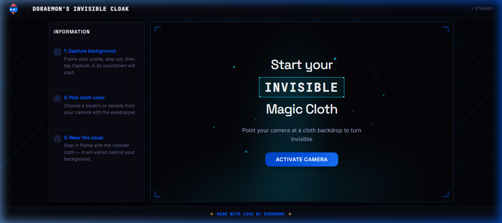

# 🌌 Doraemon's Invisible Cloak

Turn any solid-colored cloth into a real-time invisibility cloak right in your browser! Just step out of the frame to capture the background, pick your cloak's color, and watch yourself disappear.



## ⚡ How it Works
1. **Capture the Background:** Step out of the camera view for 3 seconds so the app knows what's behind you.
2. **Pick your Cloak Color:** Select from preset swatches or use the eyedropper to select your fabric color.
3. **Step in Frame:** Hold up your cloth and watch it vanish!

## 🔒 100% Private & Safe
No video frames, images, or personal data ever leave your device. All calculations and image processing happen entirely inside your browser.

## 🛠️ Quick Start

Get it running locally in under a minute:

```bash
# Install dependencies
npm install

# Start local server
npm run dev
```
Open [http://localhost:8080](http://localhost:8080) in Chrome, Edge, or Firefox.

*Note: Camera access requires a secure context (`localhost` or `https`).*
